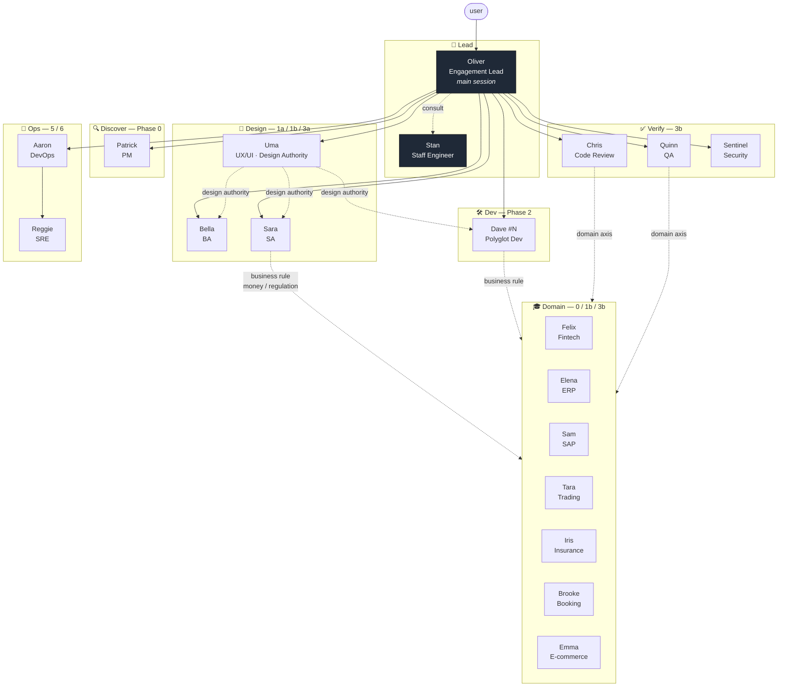
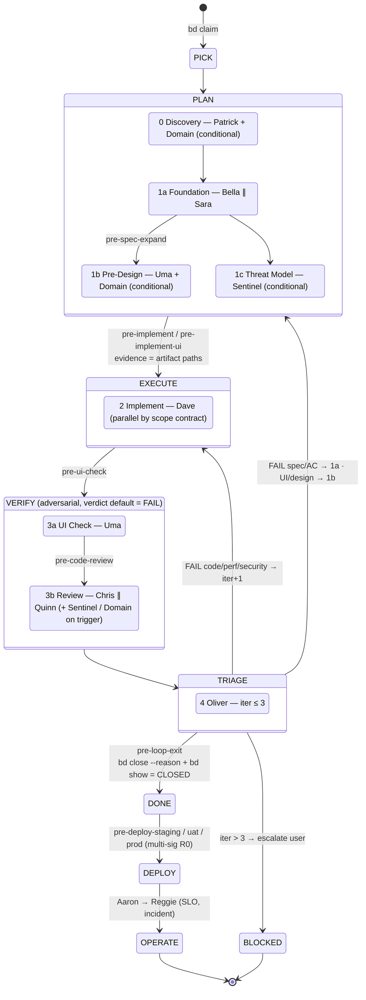
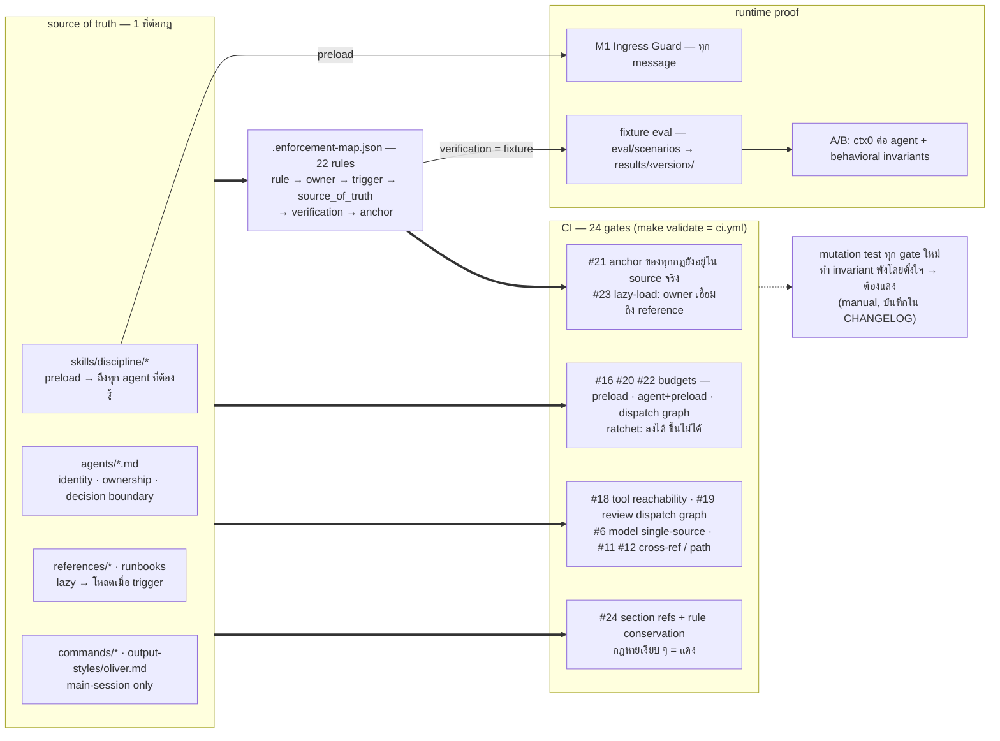

# Architecture

3 มุมมองของ shode-house: **topology** (ใครคุยกับใคร) · **lifecycle** (งาน 1 bd เดินยังไง) · **enforcement** (กฎถูกบังคับยังไง ไม่ใช่แค่เขียนไว้)

source of truth ของแต่ละรูปอยู่ในไฟล์จริง — diagram นี้เป็นภาพสรุป ถ้าขัดกัน ไฟล์ชนะ:
`agents/orchestrator.md` · `skills/discipline/shode-house-routing/SKILL.md` · `skills/discipline/shode-house-workflow/SKILL.md` · `.enforcement-map.json` · `.github/workflows/ci.yml`

---

## 1. Agent topology — 19 agents / 7 teams

กติกา: **ทุก edge ผ่าน Oliver** — agent ไม่รับงานจาก user ตรง (M7) · **single-owner** ต่อ capability, เส้นประ = consult ได้แต่ห้ามผลิต deliverable แทนเจ้าของ · **งานที่แตะ business rule** บังคับผ่าน Domain expert ห้าม Sara/Dave เดา

---

## 2. Workflow lifecycle — PEV loop ต่อ 1 bd

invariant ของ transition: **ข้าม gate ไม่ได้** · ทุก gate ต้องมี evidence path ใน bd notes · approval ผูก artifact SHA — artifact เปลี่ยนหลัง approve = approval โมฆะ · "done" พูดได้คนเดียวคือ Oliver หลัง Chris+Quinn(+Uma/Sentinel) ครบ (Anti-Puppet) · **M4** user comment บน claim = FAIL by default · **M5** spec change = bd revision ห้าม Dave fix ตรง

---

## 3. Policy / enforcement architecture — กฎถูกบังคับยังไง

หลักการ: **กฎที่ไม่มี owner / ไม่มี verification = ไม่มีกฎ** · **byte ที่ลด ≠ usage ที่ลด** — static budget เป็น ratchet แต่ตัวตัดสินคือ A/B runtime (`eval/`) · verification ใน map เป็นชื่อกลไกที่ตรวจได้จริง เช่น `ci:<n>` (static gate) · `fixture` (behavioral eval) · `mutation` · `close-gate` (bd close) · `output-style-test` — ดู `docs/enforcement-map.md`

---

## ที่ยังไม่มีใน architecture นี้ (roadmap)

- **E2E eval** ผ่าน command จริง (`/implement`, `/review`) — ตอนนี้ fixture วัดที่ระดับ agent เดี่ยว → Phase B
- **behavioral scorer** แบบ machine-verifiable + regression gate ใน CI → Phase B
- **routing เป็น declarative registry** (ตอนนี้อยู่ใน Markdown ของ Oliver/routing skill) → Phase C
- **workflow state machine ที่ runtime บังคับ** (ตอนนี้ state อยู่ใน bd + SESSION-STATE.md, invariant บังคับด้วย prompt) → Phase C
- **durable runtime engine** (ตอนนี้เป็น contract ใน `references/patterns/durable-agent-runtime.md` ที่ Aaron generate ตาม) → Phase D
